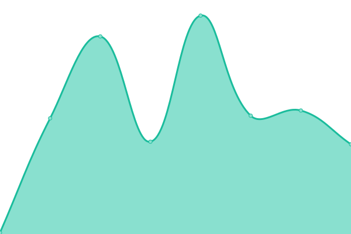
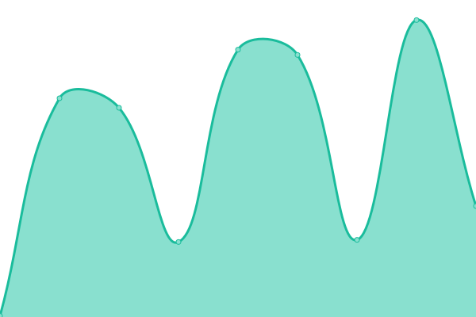
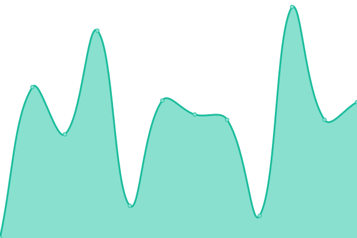

# [📈 Live Status](https://demo.upptime.js.org): <!--live status--> **🟩 所有系统运行正常**

This repository contains the open-source uptime monitor and status page for [Upptime](https://upptime.js.org), powered by [Upptime](https://github.com/upptime/upptime).

With [Upptime](https://upptime.js.org), you can get your own unlimited and free uptime monitor and status page, powered entirely by a GitHub repository. We use [Issues](https://github.com/upptime/upptime/issues) as incident reports, [Actions](https://github.com/Hootrix/upptime/actions) as uptime monitors, and [Pages](https://demo.upptime.js.org) for the status page.

<!--start: status pages-->
<!-- This summary is generated by Upptime (https://github.com/upptime/upptime) -->
<!-- Do not edit this manually, your changes will be overwritten -->
<!-- prettier-ignore -->
| URL | Status | History | Response Time | Uptime |
| --- | ------ | ------- | ------------- | ------ |
|  [Google](https://www.google.com) | 🟩 Up | [google.yml](https://github.com/Hootrix/upptime/commits/HEAD/history/google.yml) | 

 195ms
     
 | 

<a href="https://upptime.hhtjim.com/history/google">100.00%</a>
    

|  [HHTjim'S 部落格](https://www.hhtjim.com) | 🟩 Up | [hh-tjim-s.yml](https://github.com/Hootrix/upptime/commits/HEAD/history/hh-tjim-s.yml) | 

 362ms
     
 | 

<a href="https://upptime.hhtjim.com/history/hh-tjim-s">100.00%</a>
    

|  [Link](https://link.hhtjim.com) | 🟩 Up | [link.yml](https://github.com/Hootrix/upptime/commits/HEAD/history/link.yml) | 

 922ms
     
 | 

<a href="https://upptime.hhtjim.com/history/link">100.00%</a>
    

|  [Link MP3 API](https://link.hhtjim.com/163/5146554.mp3) | 🟩 Up | [link-mp-3-api.yml](https://github.com/Hootrix/upptime/commits/HEAD/history/link-mp-3-api.yml) | 

 3433ms
     
 | 

<a href="https://upptime.hhtjim.com/history/link-mp-3-api">100.00%</a>
    

|  DeeplX(H2G) | 🟩 Up | [deepl-x-h2-g.yml](https://github.com/Hootrix/upptime/commits/HEAD/history/deepl-x-h2-g.yml) | 

 419ms
     
 | 

<a href="https://upptime.hhtjim.com/history/deepl-x-h2-g">100.00%</a>
    

<!--end: status pages-->

[**Visit our status website →**](https://demo.upptime.js.org)

## 📄 License

- Powered by: [Upptime](https://github.com/upptime/upptime)
- Code: [MIT](./LICENSE) © [Anand Chowdhary](https://anandchowdhary.com), supported by [Pabio](https://pabio.com)
- Data in the `./history` directory: [Open Database License](https://opendatacommons.org/licenses/odbl/1-0/)
